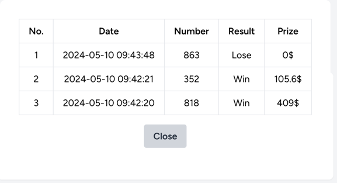

## Instalation:
```sh
composer start
```

Open - [localhost](http://localhost)

After registration it should look like:

## Tests

```sh
./vendor/bin/sail phpunit  
```

## Stop app

```sh
./vendor/bin/sail down  
```

